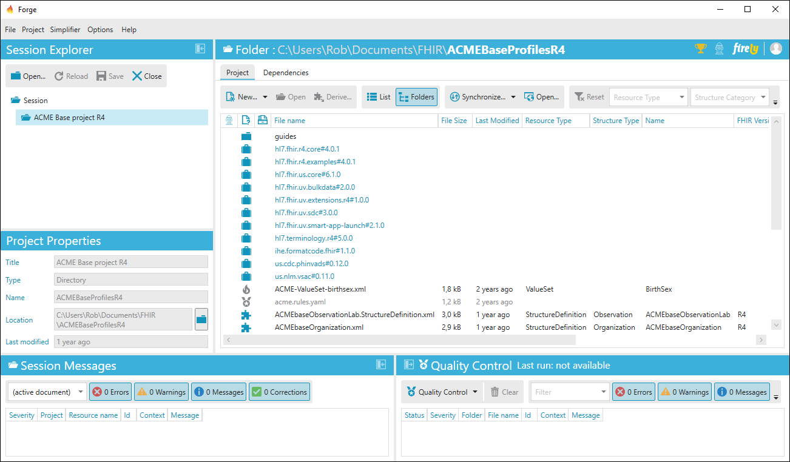

Features
=================================

Forge is the user-friendly editor for creating and editing profiles that
enables modellers to create and manage profiles using a graphical
user-interface.

With Forge you can:

.. toctree::
   :maxdepth: 1

   features/OpenaProjectFolder
   features/CreatenewProfiles
   features/EditProfiles
   features/DefineConstraints
   features/DefineExtensions
   features/DefineSlices
   features/CreateDerivedProfiles
   features/CreateLogicalModels
   features/SetForgeOptions
   features/IntegrationwithSimplifier
   features/QualityControl

All these features will be described in more detail in the above linked sections.