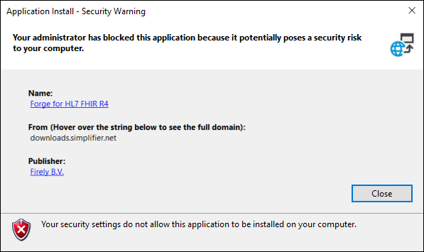

Installing Forge
================

Go to the `Forge download page <https://simplifier.net/forge>`__ to
download Forge.

Installing on Windows
---------------------

Forge is deployed using a
`ClickOnce <https://docs.microsoft.com/en-us/visualstudio/deployment/clickonce-security-and-deployment>`__
installer. You can download and install the application without
requiring administrator permissions (except .NET, see below). The
application automatically detects and installs updates when you start
the application. After installation of a new release, you will receive
automatic update notifications when you start the application.

Forge is built with the `Microsoft .NET Framework 4.7.2, .NET
7 <https://dotnet.microsoft.com/learn/dotnet/what-is-dotnet>`__ and
`WPF <https://visualstudio.microsoft.com/vs/features/wpf/>`__. The
ClickOnce installer will download and install the .NET Framework 4.7.2
if necessary. Forge itself will download and install .NET 7 if
necessary.

.. Attention:: Installing or updating the .NET Framework or .NET 7 requires
   administrator permissions. If you have insufficient permissions,
   please contact your system administrator.

Installing on other operating systems
-------------------------------------

The .NET Framework and WPF are only supported on the Windows operating
system. For users using other platforms, generally the best solution is
to **run Windows in a Virtual Machine**, on your own machine or in the
cloud, and install Forge on that.
`VirtualBox <https://www.virtualbox.org/>`__ is an example of a great,
free application to run virtual machines on your computer. Example
instructions for `installing Windows on MacOS with VirtualBox can be
found
here <https://www.howtogeek.com/657464/how-to-install-a-windows-10-virtualbox-vm-on-macos/>`__.

Resolving installation Security Warning
---------------------------------------

In some cases users find that when installing or updating Forge the
following security warning appears:

If this is the case for you, please follow `the steps listed in this
blog
post <https://www.gonnalearn.com/your-administrator-has-blocked-this-application-because-it-potentially-poses-a-security-risk-to-your-computer/>`__
to change the values of ``TrustManager`` in the registry with Registry
Editor. After that the installation should allow you to continue.

If you’re not allowed to change the registry of your computer, please
ask your administrator for help.

Installing behind a proxy
-------------------------

Users installing and using Forge behind a Proxy can run into issues.
Your organizations administrator might be able to resolve this issue by
doing the following:

1. Whitelisting the following IP addresses:

   ::

       simplifier.net              IP 40.68.205.178
       downloads.simplifier.net    IP 40.114.243.70 

2. Allow applications using port 443 (https)
3. Your administrator should allow your Proxy to support Websocket.

Additionally some users found that they had to do one extra switch to
the local users’ IE proxy settings. Although “Bypass proxy server for
local addresses” was checked, entering the IP address and/or domain name
(whichever the local users are using) into the proxy exceptions list
fixed the problem.
