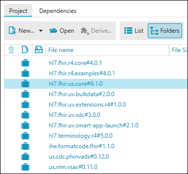
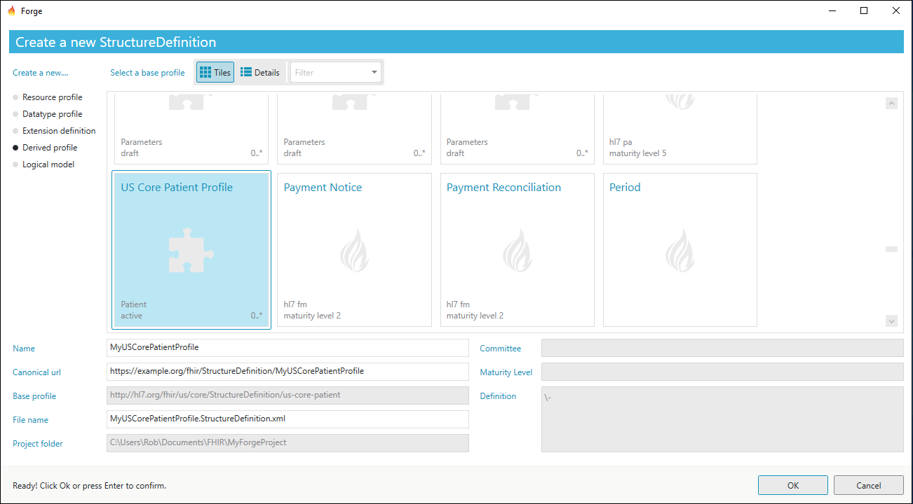
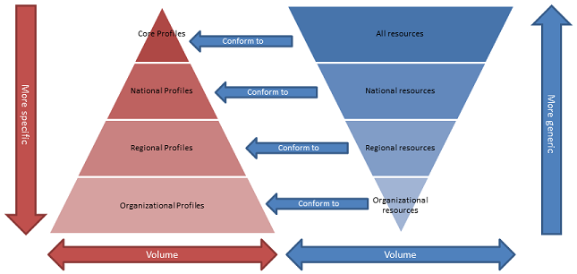

# Create Derived Profiles

With Forge you have the ability to create a
profile on top of another, existing profile, a.k.a. "derived" profile.
This will enable you and your organization to benefit from the existing
profiles and to further customize those profiles to your specific needs.
For example, take an organization that would like to begin working with
a national profile that is derived from a Core Resource. That
organization would like to utilize the changes that were made to the
Core Resource, the national profile, and then further customize that
profile to reflect organization specific needs. With Forge you can begin 
work directly on that national profile! This
saves time and effort that you would spend recreating all the changes to
the Core Resource to reflect the changes to the national profile and
then further adding your organizational constraints.

It works like this: You have a Core Resource. These are data models that
are created to fit most use cases (approximately 80% of all
occurrences). A country takes that Core Resources and constrains it to
fit the specific needs that reflect the situation in their country. This
then becomes that countries version of that Core Resource, this is now
our national profile. An organization in that country then realizes that
they would like to use the national profile but make a few extra
constraints to reflect the specific situation in their centers. The
organization can now use that national profile and begin making changes
to reflect their specific needs. This new organizational profile will
have all the inherited changes from the national profile that were made
to the original Core resource. This is what we refer to as a derived
profile. 

To do this in Forge you first need to add one or more Core Packages.
The following example adds the **hl7.fhir.us.core** package to the project.
Select the `Dependencies` tab, then click `Simplifier`, then type *hl7.fhir.us*
in the **Search** field and finally click `Search`. Select **hl7.fhir.us.core**
in the list and then select package version **4.1.0**. Finally click `Add` to
add the package to the project. 

Click the `Project` tab to see what packages are installed. Notice that dependent 
packages are installed too.

To create a derived profile for the US Core Patient, open the package 
**hl7.fhir.us.core#4.1.0** by selecting it from the list and clicking
`Open`. Then select **package** in the list and click `Open`. In the **Filter** toolbar
select **Patient** as Structure Type to filter on.

Select the US Core Patient in the list and click `Derive`.

Enter the name for the profile and click `OK`. A new derived profile is created
and opened. You can now make your own modifications.

Things to keep in mind are that you can only further constrain (or add
extensions to) profiles. This means that each derived profile is more
specific than its predecessor. Also important to point out is that the
differential that you see for your derived profile will only show
changes made to the profile which you started with. If the base profile
as a Core Resource, then the differential will reflect all constraints
with respect to that Core Resource. If the base profile is a derived
profile, e.g. a national profile like in the example above, then the
differential will reflect constraints on the national profile.

