.. _derived-profiles:

Create Derived Profiles
=======================

With Forge you have the ability to create a profile on top of another,
existing profile, a.k.a. “derived” profile. This will enable you and
your organization to benefit from the existing profiles and to further
customize those profiles to your specific needs. For example, take an
organization that would like to begin working with a national profile
that is derived from a Core Resource. That organization would like to
utilize the changes that were made to the Core Resource, the national
profile, and then further customize that profile to reflect organization
specific needs. With Forge you can begin work directly on that national
profile! This saves time and effort that you would spend recreating all
the changes to the Core Resource to reflect the changes to the national
profile and then further adding your organizational constraints.

It works like this: You have a Core Resource. These are data models that
are created to fit most use cases (approximately 80% of all
occurrences). A country takes that Core Resources and constrains it to
fit the specific needs that reflect the situation in their country. This
then becomes that countries version of that Core Resource, this is now
our national profile. An organization in that country then realizes that
they would like to use the national profile but make a few extra
constraints to reflect the specific situation in their centers. The
organization can now use that national profile and begin making changes
to reflect their specific needs. This new organizational profile will
have all the inherited changes from the national profile that were made
to the original Core resource. This is what we refer to as a derived
profile.

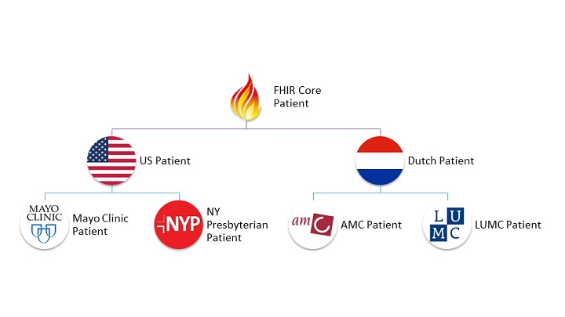

Dependencies
------------

To do this in Forge you first need to add one or more Core Packages.

Adding a public package
-----------------------

The following example adds the **hl7.fhir.us.core** package to the project.

Select the ``Dependencies`` tab, click ``Public``, then type
*us.core* in the **Search** field and finally click ``Search``.
Select **hl7.fhir.us.core** in the list and then select package version
**6.1.0**. Finally click ``Add`` to add the package to the project.

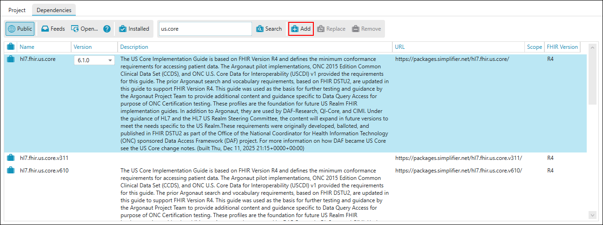

Adding a package from a feed
----------------------------

Package feeds allow organizations to manage private FHIR packages using controlled dependencies and distribution boundaries.
See the `Simplifier documentation for more information <simplifier_docs:package_feeds>`_.

Click ``Open...`` to go to Simplfier and open the **Feeds** tab of your Portal. This page
lists all the feeds that you have access to.

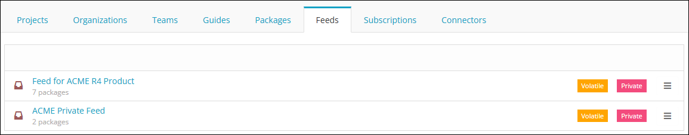

Click ``Feeds`` to open the **Package feed selection** dialog.

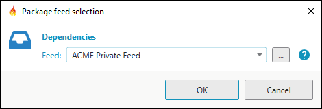

Use the drop down combobox to select a feed. You can use the ``...`` button
to see what packages are contained in the selected feed.
Click ``OK`` to select the feed.

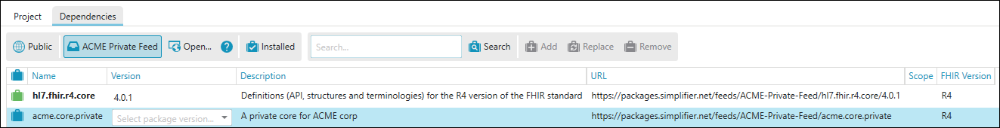

You can now add one or more packages from the selected feed to your project.

Click ``Open...`` to go to Simplfier and open the page for the selected feed.

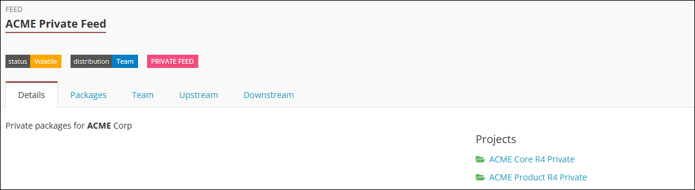

.. _managing-package-versions:

Managing package versions
-------------------------

Click ``Installed`` to see the packages your project depends on. The icon in front of each package shows its
status, which is also shown in its tooltip:

- |Package installed| **Installed**: your project depends on this package. Its name is shown in bold.
- |Package installed| **Installed as dependency**: the package is installed because another package depends on it.
- |Package missing| **Missing**: your project depends on this package, but it is not installed, e.g. because it
  could not be downloaded.

In the ``Public`` and ``Feeds`` views, select a package and a version in the **Version** list, then click:

- ``Add`` to add the selected version to your project. If your project already depends on another version of
  this package, both versions are kept.
- ``Replace`` to replace the installed version of the selected package with the selected version. This is
  available when your project depends on one version of the package.
- ``Remove`` to remove the selected version from your project. Other versions of the package stay.

A package that is installed in more than one version is marked *(side by side)*. Its tooltip lists the
installed versions. An unpinned reference resolves to the highest installed version. To use another
version, pin the reference to that version (see :ref:`version-pinning`).

.. note::
  In *package.json*, Forge declares the second version of a package under an alias, because a package
  name can only appear once in the dependencies:

  .. code-block:: json

     {
       "dependencies": {
         "hl7.fhir.us.core": "6.1.0",
         "hl7.fhir.us.core-3.1.1@npm:hl7.fhir.us.core": "3.1.1"
       }
     }

Project
-------

Click the ``Project`` tab to see what packages are installed. Notice
that dependent packages are installed too.

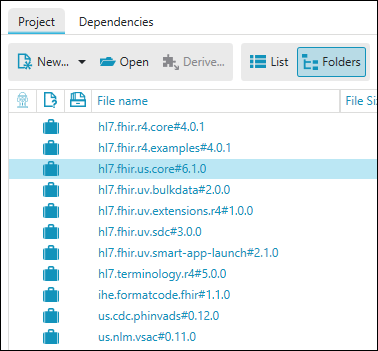

To create a derived profile for the US Core Patient, open the package
**hl7.fhir.us.core#6.1.0** by selecting it from the list and clicking
``Open``. Then select **package** in the list and click ``Open``. In the
**Filter** toolbar select **Patient** as Structure Type to filter on.

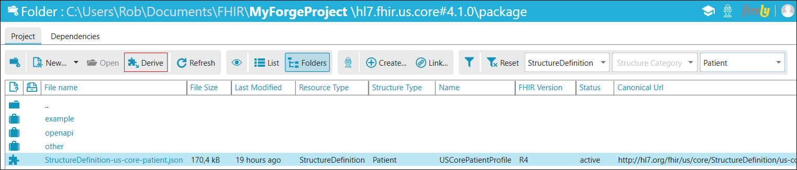

Select the US Core Patient in the list and click ``Derive``.

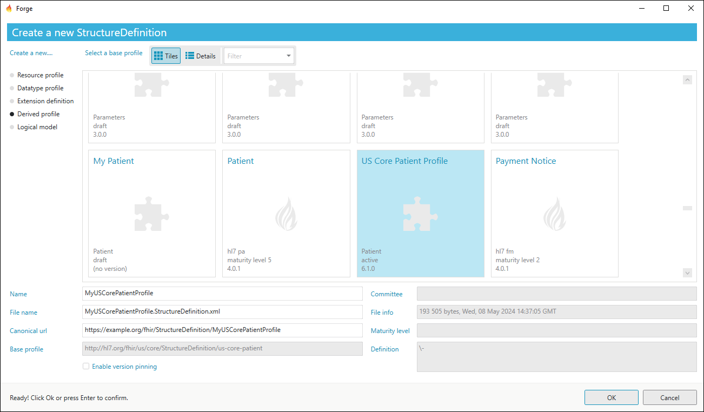

When your project contains more than one version of the base profile, you can select the version to use and
pin the reference to it. See :ref:`version-pinning`.

Enter the name for the profile and click ``OK``. A new derived profile
is created and opened. You can now make your own modifications.

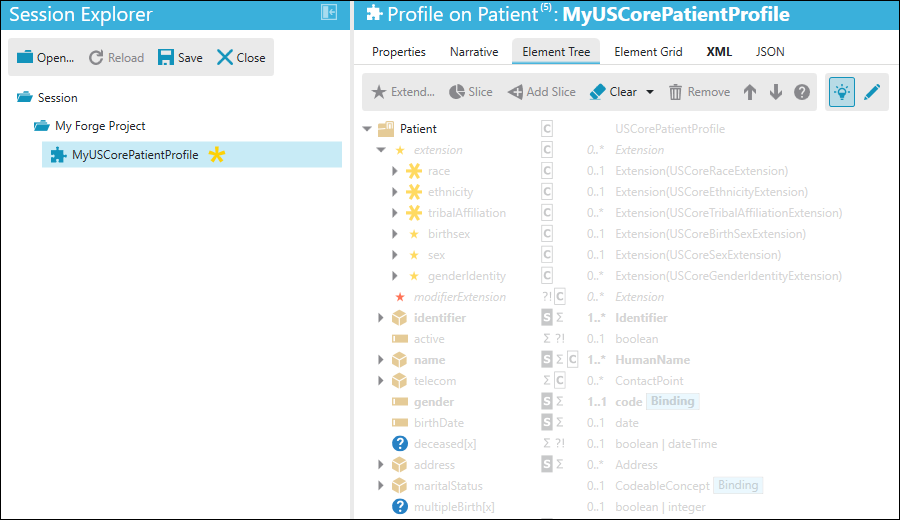

Things to keep in mind are that you can only further constrain (or add
extensions to) profiles. This means that each derived profile is more
specific than its predecessor. Also important to point out is that the
differential that you see for your derived profile will only show
changes made to the profile which you started with. If the base profile
as a Core Resource, then the differential will reflect all constraints
with respect to that Core Resource. If the base profile is a derived
profile, e.g. a national profile like in the example above, then the
differential will reflect constraints on the national profile.

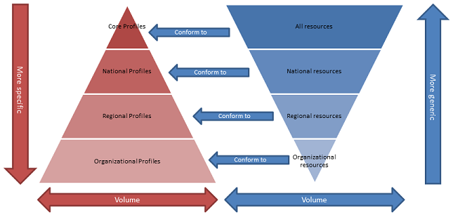