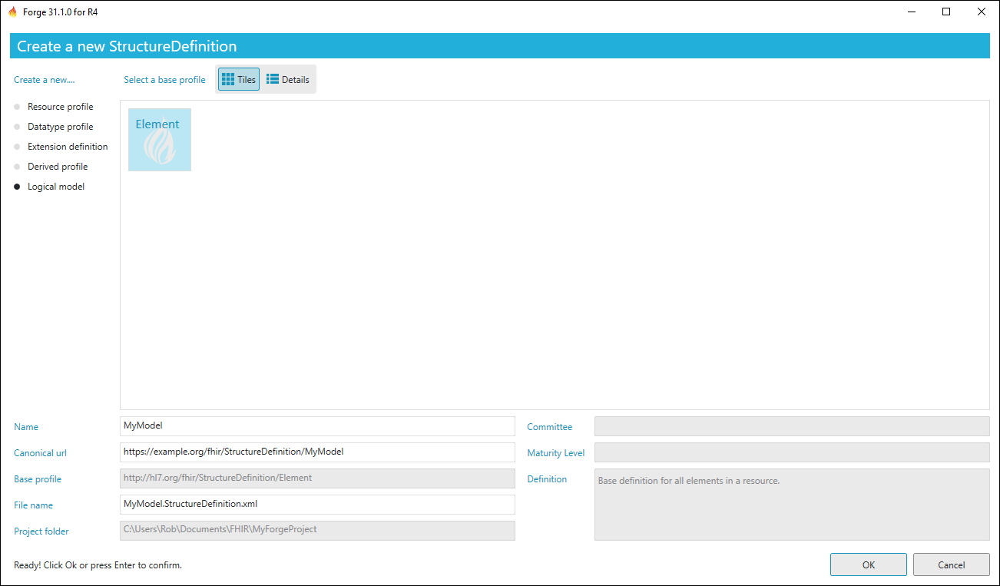
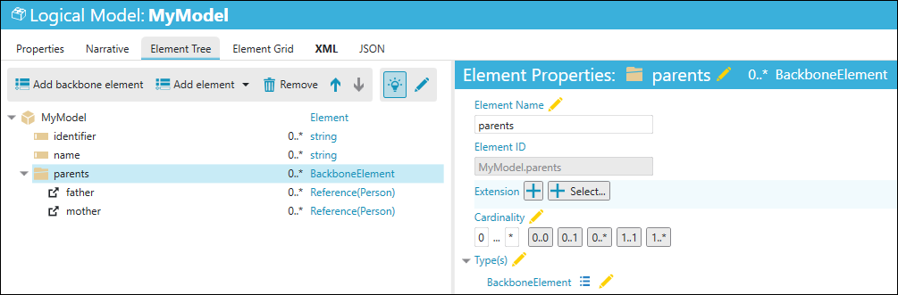
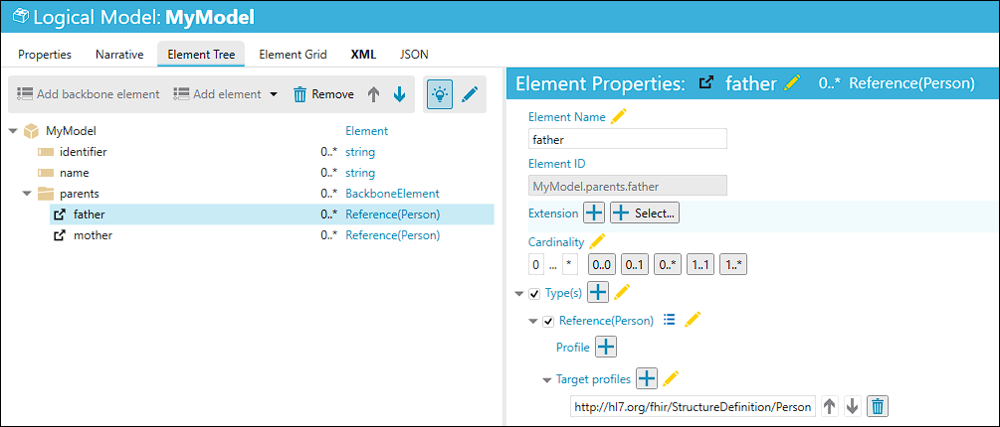

Create Logical Models
=====================

Forge also supports the authoring of Logical Models. A logical model
represents an abstract data model that is not derived from one of the
core FHIR resources or datatype.

Note: you cannot create an instance of a Logical Model. Logical Models
must be mapped to actual FHIR resources. Actual data exchange is always
based on FHIR resources. FHIR provides a StructureMap resource and a
mapping language that allow you to define and implement the actual
mapping operations.

From your project folder, go to ``New...`` and click
``New Logical Model`` (or **Ctrl+M**) to create a new logical model.
Enter a name for your logical model and click ``OK``.

You can customize the meta properties for your model and add backbone
elements and typed elements. A backbone element has no datatype. A
backbone element may contain other child elements; either typed elements
and/or other (nested) backbone elements.

A typed element is mapped to a FHIR datatype or resource profile.

You cannot introduce new child elements of a typed element, because they
are implicitly defined by the element datatype profile.You also have the
ability to customize all backbone elements and sub elements to constrain
their cardinality, specify their datatypes etc.
