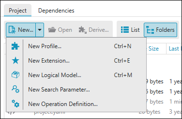
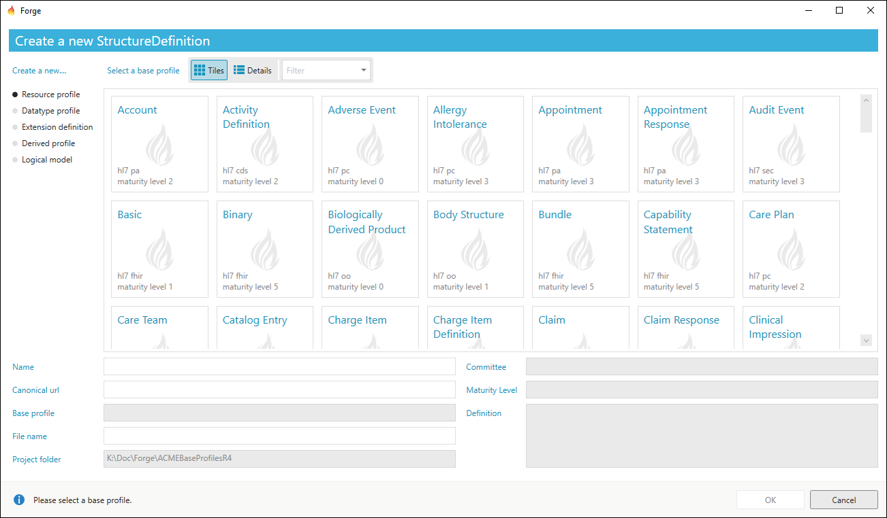

Create new Profiles
===================

Forge enables you to create your own FHIR Profiles, based on one of the
FHIR base resources. To open a base resource and start editing, you can
select ``New...`` \\ ``New Profile`` (or **Ctrl+N**) from your project
folder.

This will open a window in which you can select one of the base
Resources or DataTypes.

New profile resource selection
------------------------------

If you selected the base Resource you need, you can start to create your
own Profile based on this Resource. The different options you can use in
editing your Profile will be explained in the following sections.
