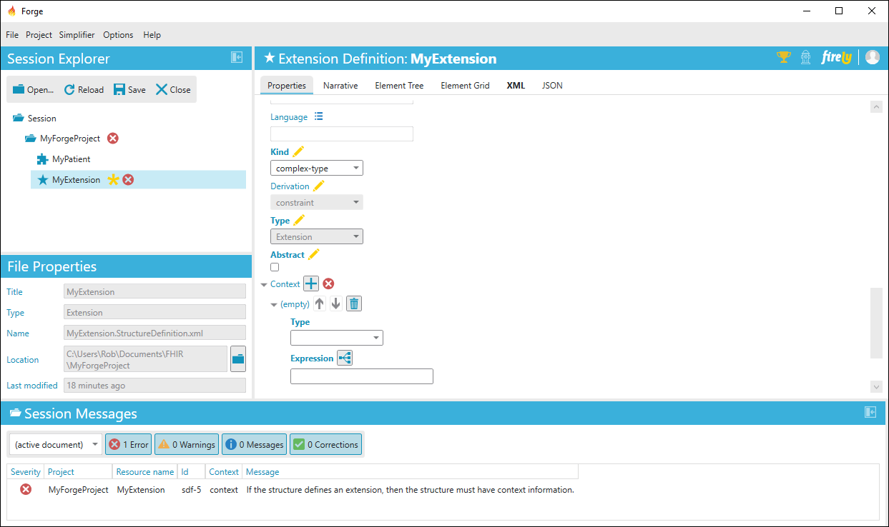
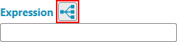
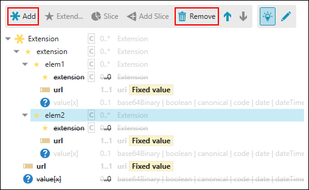
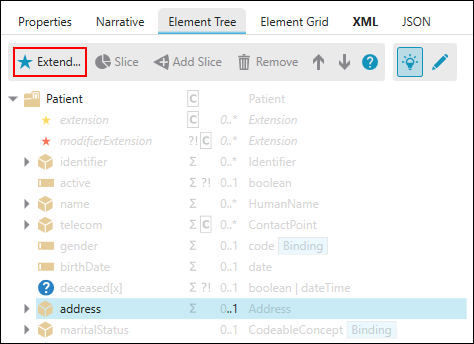
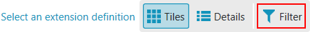

# Define Extensions

Within Forge you can extend your profiles or elements with extensions
created by yourself or others. 

## Extension registry

When using extensions, first consult the extension registry at
<http://hl7.org/fhir/extensibility-registry.html> or <http://simplifier.net/> to
find already defined extensions that may be suitable for your needs. For
example, extending a Patient profile with the place of birth can be done
with an already existing extension found in in the HL7 extension
registry.

## New extension

If you cannot find an already defined extension you can make your own.
From your project folder, go to `New...` and click `New Extension` (or **Ctrl+E**) to create a new extension. 
Forge shows warning messages in the lower section of the your screen highlighting the need to provide context
information for this new extension.

Provide this information in `Properties` tab of the extension. Context Type 
indicates if the extension extends a Resource, Datatype, Mapping or another 
Extension. Give the exact context by clicking the button next to **Expression**. 

This brings you to a new screen were you can select the specific resource or
datatype where the extension is allowed to be placed. If you extend on the resource
level you can click Select Resource. If you extend an element first
select that element and then click Select Element. Depending on where
the extension may be used, you can add more context information. You can
provide a canonical URL, name and other relevant information in the
properties section as well. 

## Extension profile

A new extension starts with one element containing a Value\[X\]. A
Value\[X\] can contain all datatypes, most likely this needs to be
constrained to a more specific datatype. This can be done in the `Element
Properties` tab by selecting the wanted datatype(s). An extension
containing more elements is called a complex extension. Elements can be
added and removed from the extension profile with the use of the `Add` and
`Remove` buttons. Added elements will be placed a level lower than the
selected element.

## Add the extension to the profile

Note that to add extensions, they need to be available in your project
folder. So you will either need to create your own extension and save it
to your project folder or add a package to your project
folder. 

Select the element in the Element Tree of your profile where you
want to add the extension. Then, click `Extend` which is shown in the
tool section above the element tree. 

Forge shows the extensions that are available in your project folder.

Note that you can only select extensions that are compatible with your
context (e.g. when extending an AdverseEvent resource you can only
select an extension that has this resource as a context). By default,
incompatible extensions are hidden, but you can also view incompatible extensions by 
clicking `Filter` to turn off filtering.

