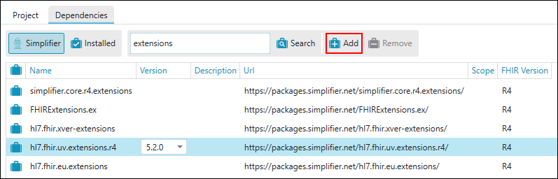
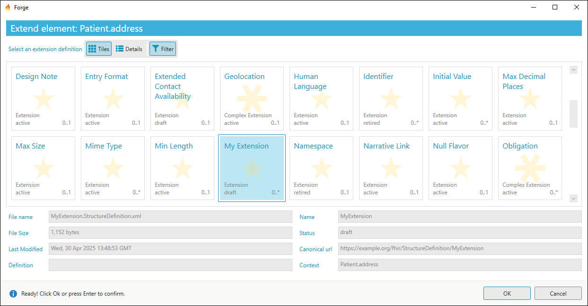
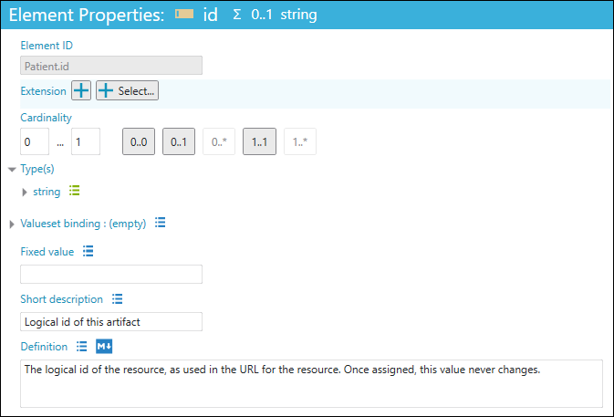

Define Extensions
=================

Within Forge you can extend your profiles or elements with extensions
created by yourself or others.

Extension registry
------------------

When using extensions, first consult the extension registry at
http://hl7.org/fhir/extensibility-registry.html or
http://simplifier.net/ to find already defined extensions that may be
suitable for your needs. For example, extending a Patient profile with
the place of birth can be done with an already existing extension found
in in the HL7 extension registry.

New extension
-------------

If you cannot find an already defined extension you can make your own.
From your project folder, go to ``New...`` and click ``New Extension``
(or **Ctrl+E**) to create a new extension. Forge shows warning messages
in the lower section of the your screen highlighting the need to provide
context information for this new extension.

.. figure:: ../images/PatientExtensionBirthPlaceContext.png
   :alt: Editing an extension context with Forge
   :width: 1302

Provide this information in ``Properties`` tab of the extension. Context
Type indicates if the extension extends a Resource, Datatype, Mapping or
another Extension. Give the exact context by clicking the button next to
**Expression**.

.. figure:: ../images/PatientExtensionBirthPlaceContextExpressionButton.png
   :alt: Editing an extension context with Forge
   :width: 200

This brings you to a new screen were you can select the specific
resource or datatype where the extension is allowed to be placed. If you
extend on the resource level you can click Select Resource. If you
extend an element first select that element and then click Select
Element. Depending on where the extension may be used, you can add more
context information. You can provide a canonical URL, name and other
relevant information in the properties section as well.

Extension profile
-----------------

A new extension starts with one element containing a Value[X]. A
Value[X] can contain all datatypes, most likely this needs to be
constrained to a more specific datatype. This can be done in the
``Element Properties`` tab by selecting the wanted datatype(s). An
extension containing more elements is called a complex extension.
Elements can be added and removed from the extension profile with the
use of the ``Add`` and ``Remove`` buttons. Added elements will be placed
a level lower than the selected element.

.. figure:: ../images/ExtensionProfiling.png
   :alt: Adding and removing elements from an extension in Forge
   :width: 491

Add the extension to the profile
--------------------------------

Note that to add extensions, they need to be available in your project
folder. So you will either need to create your own extension and save it
to your project folder or add a package to your project folder.

Select the element in the Element Tree of your profile where you want to
add the extension. Then, click ``Extend`` which is shown in the tool
section above the element tree.

.. figure:: ../images/SelectElement.png
   :alt: Adding an extension to a profile in Forge
   :width: 462

Forge shows the extensions that are available in your project folder.

Note that you can only select extensions that are compatible with your
context (e.g. when extending an AdverseEvent resource you can only
select an extension that has this resource as a context). By default,
incompatible extensions are hidden, but you can also view incompatible
extensions by clicking ``Filter`` to turn off filtering.

.. figure:: ../images/SelectExtensionFilter.png
   :alt: Showing only compatible extensions in Forge
   :width: 359

Add the extension to an element property
----------------------------------------

In addition to adding extensions to elements in the Element Tree of your profile
you can also add extensions to some of the element properties.

If an element property can be extended then a details button is shown next to it. 
The color indicates if the element property has extensions:

-  |No extensions| The element property does not have any extensions.
-  |Inherited extensions| The element property has one or more inherited extensions.
-  |Constrained extensions| The element property has one or more constrained extensions.

Extensions on element properties are supported for:

- Primitive types

  - string
  - markdown
- Data types

  - Address
  - Coding
  - CodeableConcept
  - ElementDefinition
  - UsageContext
- Element definition components

  - Base
  - Binding

    - Additional **(R5)** 
  - Slicing
  - Type

You can view and edit extensions by clicking on the details button.
To hide the extensions just click on the details buttton again.
The following buttons are available to add a new extension to the element property:

The ``+`` button creates a new empty extension. 
The ``+ Select...`` button opens a dialog showing the matching extensions that are available in your project folder.
The |Translation extension| button is only available for **string** and **markdown** properties and provides a shortcut for the translation extension.

For simple extensions only the **value** field is available.

.. figure:: ../images/ExtensionSimple.png
   :alt: Simple extension
   :width: 385

Complex extensions contain elements that can either be value fields or child extension slices. 
If an element has a maximum cardinality of 1 then the element is always shown even if it is optional (you can leave it empty). 
If an element has a maximum cardinality higher than 1 then the element is a child extension slice and it will be listed in the
``Add slice`` dropdown box. You can add a new child extension slice by selecting the appropriate
child extension slice name from the list.

Show Element Properties Details
~~~~~~~~~~~~~~~~~~~~~~~~~~~~~~~

To quickly show or hide extensions globally on all element properties you can use one of the following commands
from the ``Options`` menu.

- **On command only** (Ctrl+1)

  Extensions are only displayed when you click the details button next to the element property.
- **When Constrained** (Ctrl+2)

  Extensions are displayed when they have one or more constraints. This is the default selection.
- **When Constrained Or Inherited** (Ctrl+3)

  Extensions are displayed when they have one or more constraints or when the base profile has defined one or more extensions.
- **Element Id** (Ctrl+4)

  Show or hide all **Element Id** fields for extensions. By default **Element Id** fields for extensions are hidden.
  
  .. image:: ../images/ExtensionElementId.png
    :width: 488

