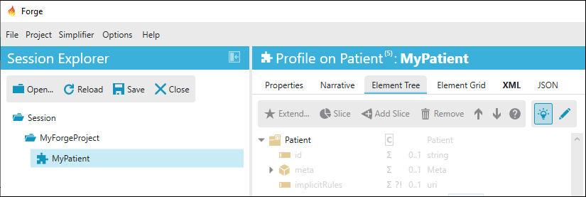
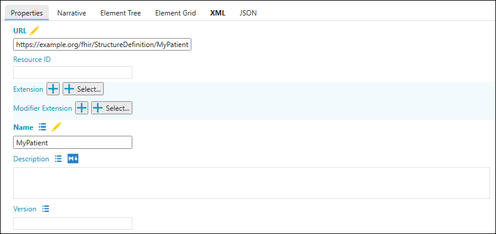
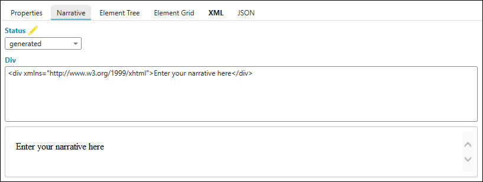
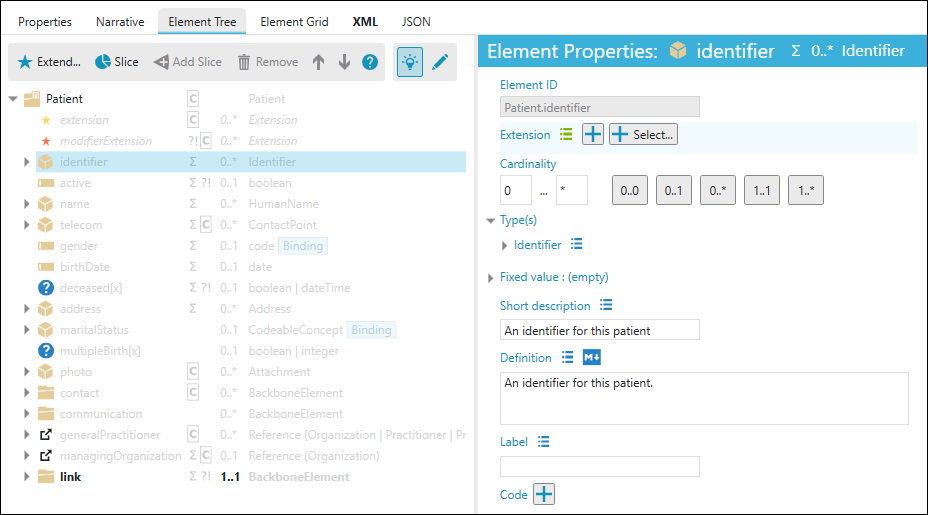
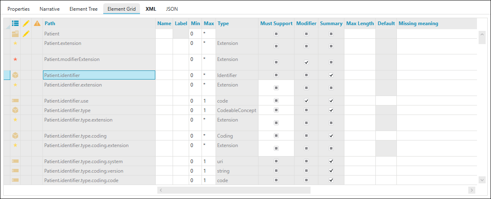
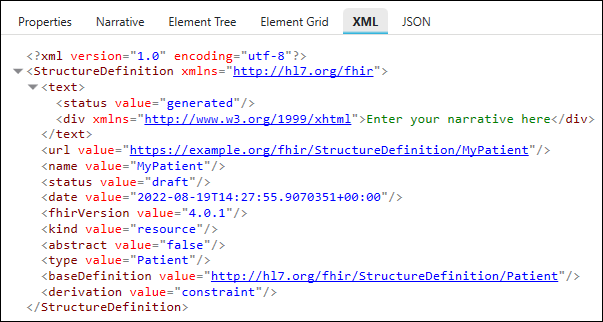

Edit Profiles
=============

Within Forge you can differentiate between the five tabs which are shown
in the screenshot below. This section describes these tabs in more
detail.

Properties
----------

In Forge you can edit the properties of a Profile as well as the
elements of the Profile. Properties of the Profile are, for example, the
profile URL, name, and publishing date. These values can be edited under
the ``Properties`` tab.

Narrative
---------

A profile's narrative can be adjusted under the ``Narrative`` tab. The
narrative is a XHMTL fragment which is intended to contain a summary of
the resource and is used to represent the content of the resource to a
human. On default this is a Generated Narrative of the profile, meaning
the content is entirely generated from the structured data in the
profile.

Element Tree and Element Grid
-----------------------------

Elements of the FHIR base Resource and extension can be edited to make
your own profile. In Forge you can view and edit these elements in the
Element Tree or in the Element Grid.

Element Tree
~~~~~~~~~~~~

Via the ``Element Tree`` tab you can edit Element Properties, slice
Elements, or add extensions.

Element Grid
~~~~~~~~~~~~

XML viewer
----------

The ``XML`` tab is the XML viewer of the current profile. The XML viewer
only shows the differential. A snapshot can be obtained by saving your
work after the option **Save snapshot component** is checked in the
``Persistence`` tab in the ``Settings`` dialog (``Options`` menu).

