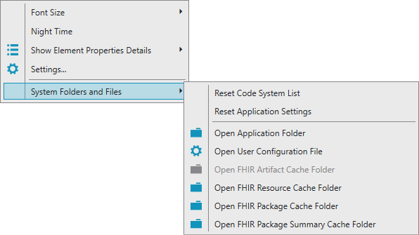
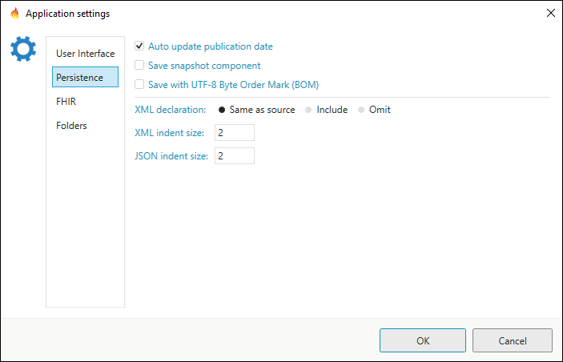

Forge Options
=============

Forge provides several options regarding rendering and saving in the
``Options`` menu.

Settings
--------

User Interface
~~~~~~~~~~~~~~

.. figure:: ../images/Settings_UserInterface.png
   :alt: The user interface settings
   :width: 527

-  **Night Time**

   Switch between light and dark color theme for the Forge user interface.
   
 .. list-table:: 

     * - .. image:: ../images/Settings_NightTime_Off.png
            :width: 651

       - .. image:: ../images/Settings_NightTime_On.png
            :width: 651

     * - *Night Time Off*

       - *Night Time On*

-  **Xml Folding**

   When turned on allows you to collapse and expand nodes in the **XML viewer**.

 .. list-table:: 

     * - .. image:: ../images/Settings_XmlFolding_Off.png
            :width: 536

       - .. image:: ../images/Settings_XmlFolding_On.png
            :width: 536

     * - *Xml Folding Off*

       - *Xml Folding On*

-  **Show common resource elements (id, meta, ...)**

   Shows or hides common resource elements in the **Element Tree**.

 .. list-table:: 

     * - .. image:: ../images/Settings_CommonElements_Off.png
            :width: 408

       - .. image:: ../images/Settings_CommonElements_On.png
            :width: 408

     * - *Show common resource elements Off*

       - *Show common resource elements On*

-  **Show child elements when sliced**

   This option allows you to see the constraints that can be put on the
   sliced element. These constraints are implemented on all the slices.
   This is summarized in the “All slice” once rendered on Simplifier.

 .. list-table:: 

     * - .. image:: ../images/Settings_SliceElements_Off.png
            :width: 418

       - .. image:: ../images/Settings_SliceElements_On.png
            :width: 419

     * - *Show child elements when sliced Off*

       - *Show child elements when sliced On*

-  **Expand all constrained elements on load**

   This option will expand constrained elements in the **Element Tree** when a resource is loaded.

 .. list-table:: 

     * - .. image:: ../images/Settings_ExpandElements_Off.png
            :width: 424

       - .. image:: ../images/Settings_ExpandElements_On.png
            :width: 424

     * - *Expand constrained elements Off*

       - *Expand constrained elements On*

-  **Force garbage collection on unload**

   When switched on this option will try to free up system memory when you close a document.

-  **Disable hardware rendering**

   If you encounter rendering issues with the Forge user interface then those are most likely caused by the video driver.
   In that case you can turn off hardware rendering.

-  **Element Tree modified style**

   Selects how modified elements in the **Element Tree** are displayed.

 .. list-table:: 

     * - .. image:: ../images/Settings_ModifiedStyle_Dimmed.png
            :width: 425

       - .. image:: ../images/Settings_ModifiedStyle_Pen.png
            :width: 425

     * - *Unmodified elements are displayed dimmed*

       - *Modified elements are indicated with a pen*

Persistence
~~~~~~~~~~~

-  **Resolve resources from subfolders**

   Indicates the default setting for whether or not subfolders should be included when searching for resources in your project folder.
   You can always change the setting in the **Open FHIR Project Folder** dialog.

 .. image:: ../images/Settings_IncludeSubfolders.png
    :width: 787

-  **Auto update publication data**

   When switched on this option will update the Date element of a conformance resource to the current date and time when uploading
   a resource to Simplifier.

-  **Save snapshot component**

   This option allows you to generate and include the snapshot component of a structure definition when saving a file to disk.

-  **Save with UTF-8 Byte Order Mark (BOM)**

   The UTF-8 BOM is a sequence of bytes at the start of a text file (0xEF, 0xBB, 0xBF) that allows the reader to more reliably guess a file as being encoded in UTF-8.

-  **Xml declaration**

   Xml documents can contain an Xml declaration that if present, must be the first construct in the document and it looks like this: ``<?xml version="1.0" encoding="utf-8"?>``.
   Forge has three options that allow you to specify when Xml declarations are saved to a resource:

   - Same as source
   - Include
   - Omit

   Note that when saving resources that are newly created, duplicated or upgraded, the Xml declaration is included when the option is set to **Same as source** or **Include** and omitted when set to **Omit**.

-  **Xml indent size**

   The indent size to use when saving Xml files.

-  **Json indent size**

   The indent size to use when saving Json files.

FHIR
~~~~

.. figure:: ../images/Settings_FHIR.png
   :alt: The FHIR settings
   :width: 526

-  **Validate FHIRPath expressions**

   All FHIRPath expressions in your resource are validated when this option is checked.

-  **Initialize global mappings from base profile**

   When creating a new profile this option will copy all the mappings from the base profile to the new profile.

 .. image:: ../images/Settings_GlobalMappings.png
    :width: 382

-  **Discard DomainResource.text values**

   When this option is checked the **text** element of a **DomainResource** is cleared when it is opened.
   In effect this will clear the **Narrative** of your resource.

 .. image:: ../images/Settings_DiscardResourceText.png
    :width: 431

Folders
~~~~~~~

.. figure:: ../images/Settings_Folders.png
   :alt: The folders settings
   :width: 526

-  **Parent folder FHIR projects**

   The default parent folder for your FHIR projects.
