# Integration with Simplifier

[Simplifier.net](https://simplifier.net/) is a FHIR specification development, collaboration and publishing platform. 
The documentation for the platform can be found [here](https://docs.fire.ly/projects/Simplifier/).

Forge can synchronize the project files in your local folder with the files in your project on Simplifier.

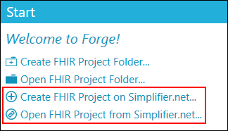

The following menu and toolbar options have been added:
* 
Create a FHIR Project on Simplifier
* 
Open a FHIR Project from Simplifier / Link to a FHIR Project on Simplifier
* 
Synchronize a FHIR Project with Simplifier

The `Project` tab contains a new toolbar with additional Simplifier options.

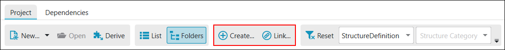

The following paragraphs describe the options in more detail.

## Create a FHIR Project on Simplifer

When starting a new project, you first have to create a project on Simplifier.
At the moment you can only do that via the Simplifier website. In Forge you can browse
to the Simplifier **Create project** page using one of the following options:
* Click `Create FHIR Project on Simplifier.net...` in one of the following places:

  - File menu
  - Start panel  
  - Session panel  
* Click `Create...` in the Simplifier toolbar in the Project tab:  

Enter you project details on Simplifier and click `Create`.

## Open a FHIR Project from Simplifer

* Click `Open FHIR Project from Simplifier.net...` in one of the following places:

  - File menu
  - Start panel
  - Session panel

The first time you do this you have to select the parent folder for your FHIR projects.
Forge will remember the parent folder you selected but you can change it at any time by opening 
the `Options` menu and selecting the menu item `Select parent folder FHIR projects...`.

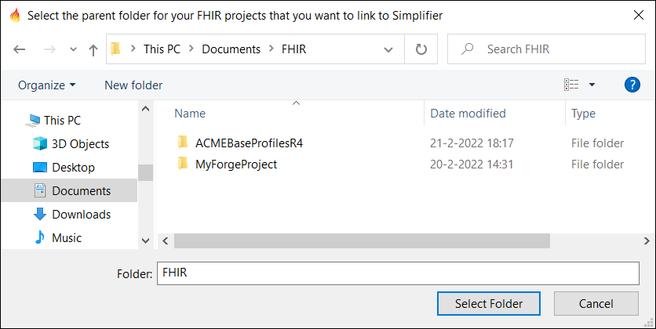

Select the parent folder and click `Select Folder`. A dialog is opened listing all the available 
projects on Simplifier you can open. When you select a different project from the list,
the project folder name is updated automatically. Note that you can still manually change 
the project folder name if you want.

The project item tooltip displays the project title, description,  URL Key
and folder icon information:

* 	
An empty folder icon indicates that the project folder does not exist or is empty.
* 	
A full folder icon indicates that the project folder already contains files and/or subfolders.
* 
Project folders that are already linked to Simplifier are disabled for selection.

The `Select parent folder FHIR projects...` button allows you to change the parent folder for your FHIR projects..
The `Filter` button hides projects that are not compatible with the FHIR version of Forge. 
Turn the filter off to list project for all FHIR versions.

Click `Open` to create the project folder and download all project files from Simplifier.

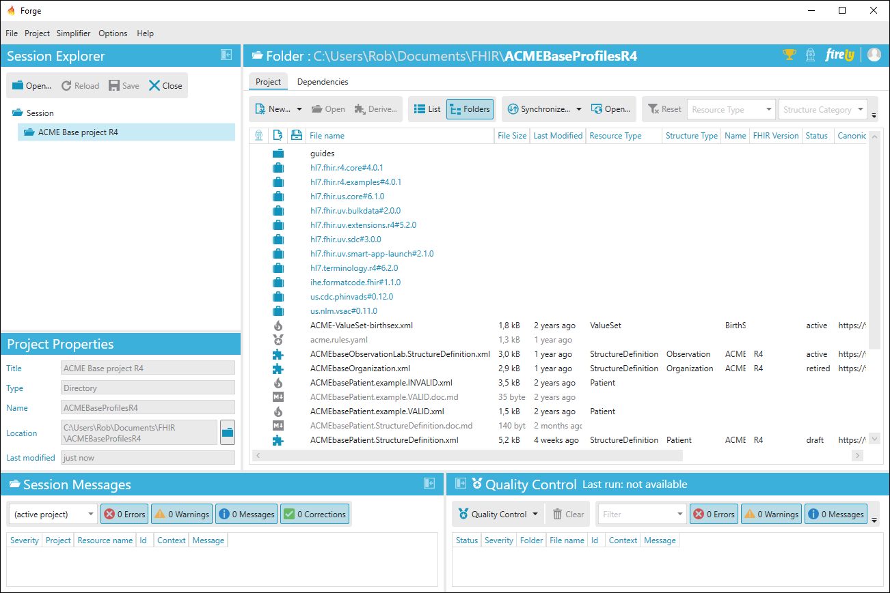

### Open a FHIR Project from Simplifer when you already have a local project folder with files

If you select a project folder that already contains resource files and one or
more files do not match up with the files already on Simplifier, the following dialog will open.

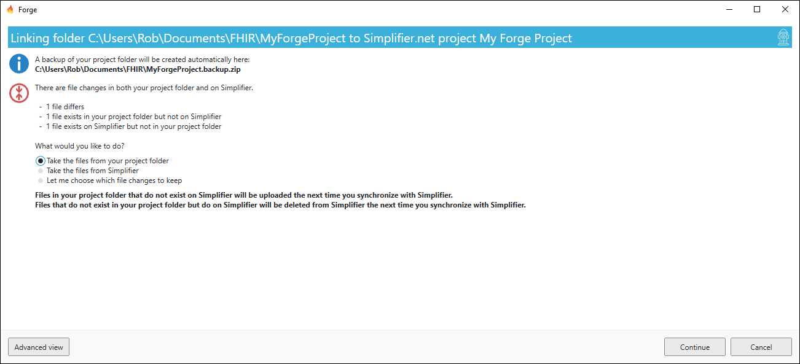

You have three options to specify what you would like to do:

* **Take the files from your project folder:**  
If a file exists both in your project folder and on Simplifier, then your local file will be taken.
Files on Simplifier that do not exist in your project folder will be deleted the next time you 
synchronize with Simplifier.
* **Take the files from Simplifier:**  
If a file exists both in your project folder and on Simplifier, then the Simplifier file will be taken.
Files in your project folder that do not exist on Simplifier will be deleted.
* **Let me choose which file changes to keep**

Click `Advanced view` to show a list of all conflicting file changes. 
When you have selected the option  
`Let me choose which files to keep` you can 
choose to keep either your local file change or the file change on Simplifier.

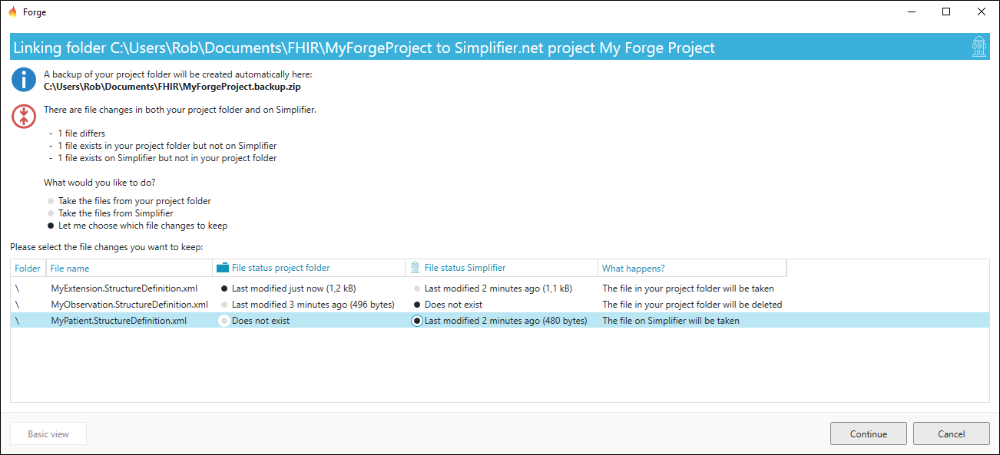

Click `Continue` to create a backup of your local project folder and 
download the relevant project files from Simplifier.

## Link to FHIR Project on Simplifer

If you have opened a project folder but you have not yet setup a link with an existing 
Simplifier project, you can do so by clicking `Link` in the Simplifier toolbar.

This will open a dialog listing all the available projects on Simplifier you can open.

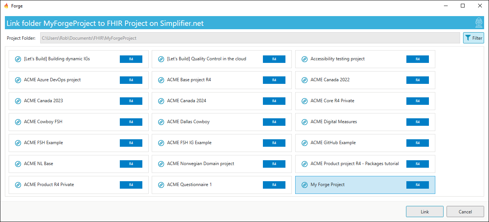

You cannot change the project folder here because you are linking a Simplifier project to 
your current project folder. Select the correct Simplifier project from the list and click `Link` 
to continue.

## Status of project files

When you add new profiles to your project or modify existing profiles, Forge indicates 
this in the project list view with yellow status icons. A pen indicates a modified file 
and a pen with a plus sign indicates an added file.

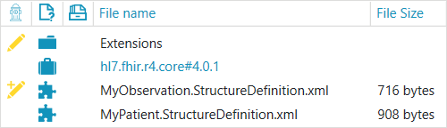

Forge is watching for changes in your project folder so any modifications you make outside 
of Forge will be reflected in the list view. Note that changes to non-resource files 
(for example mark-down files) in your project folder will be included as well when 
synchronizing with Simplifier even though Forge does not list them.

## Synchronizing project files

By clicking the `Synchronize...` button Forge will first download updated files from Simplifier 
and then upload updated files from your folder to Simplifier. You can also download or upload 
separately by clicking the drop-down arrow and clicking the desired option. The `Open...` button
opens a browser to your project on Simplifier.

When you click a synchronize button a dialog is opened showing you a summary of what will be synchronized.

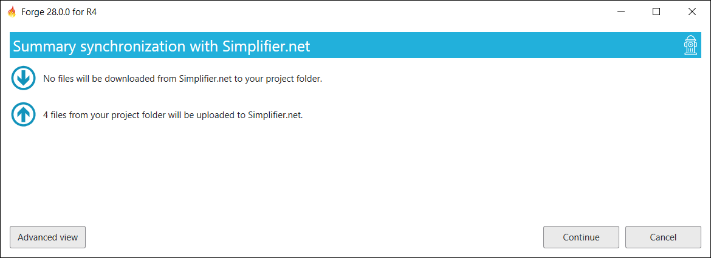

By default, the Normal view is displayed. This view will simply describe what will happen 
without details. If you want to see more details you can switch to the Advanced view by clicking
`Advanced view`.

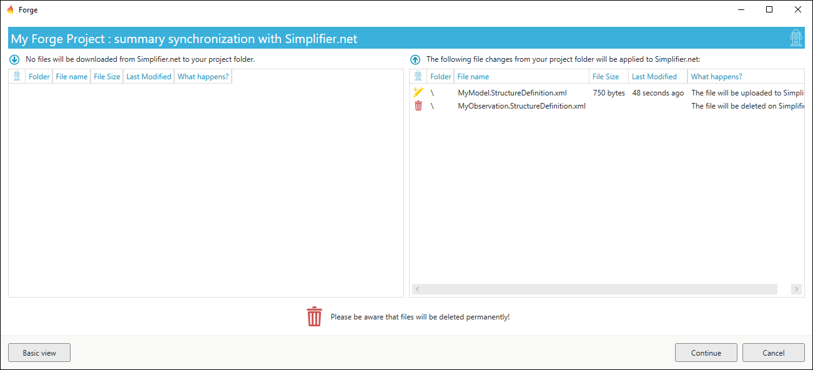

You can return to the Normal view by clicking `Normal view`. Click `Continue` to
synchronize with Simplifier.

## Conflicting file changes

It can happen that multiple people make modifications to the same resource. 
Forge can detect this but it has limited options to resolve a conflict.
You are not required to resolve conflicts but then these resources will not be 
synchronized.

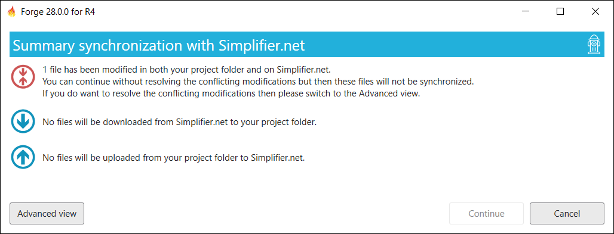

To resolve conflicts you have to switch to the Advanced view by clicking `Advanced view`.
For each listed file conflict you have 3 choices:
- **Take yours:**  
The file from your local project folder will be uploaded to Simplifier and replaces the file on Simplifier.
- **Take theirs:**  
The file from Simplifier is downloaded and replaces the file in your project folder.
- **Leave unresolved:**  
The conflict remains unresolved therefor no file upload or download will take place.

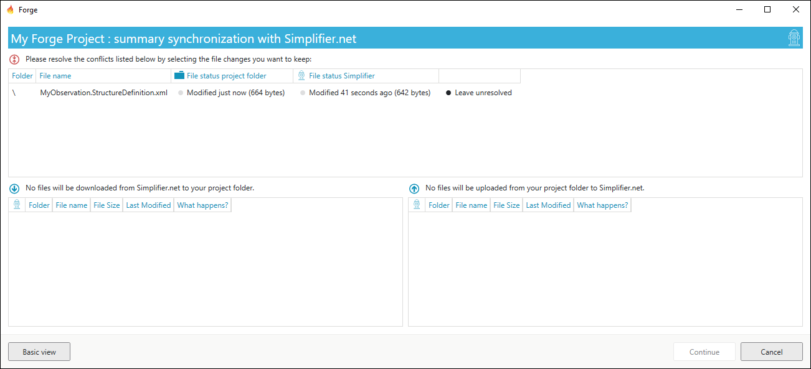

