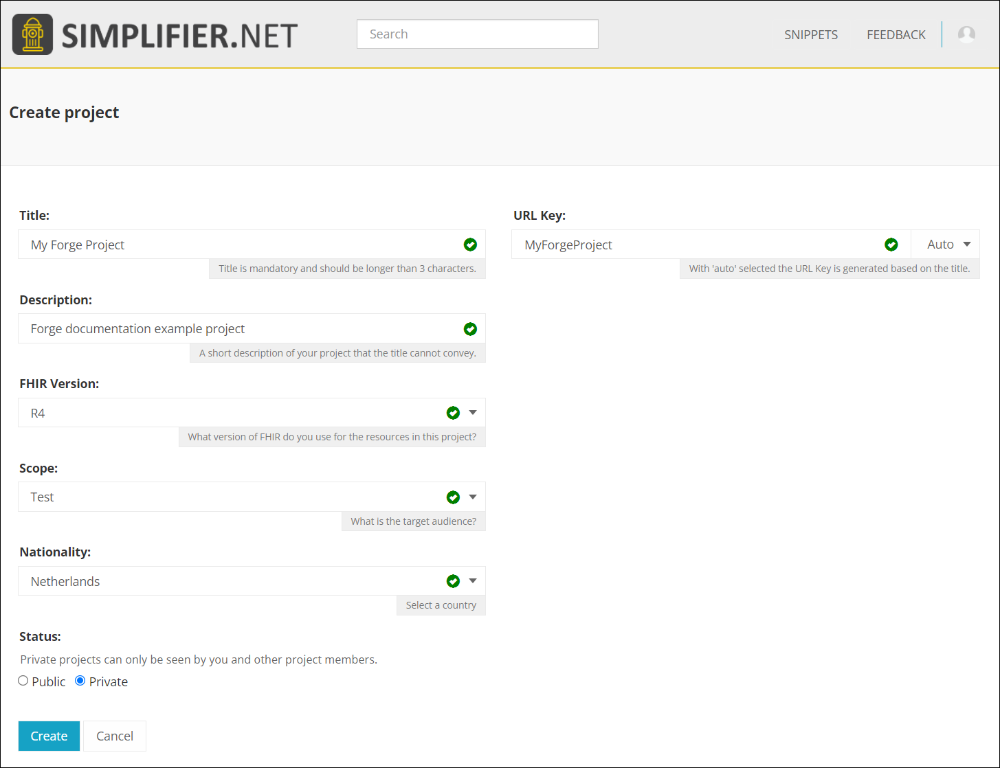
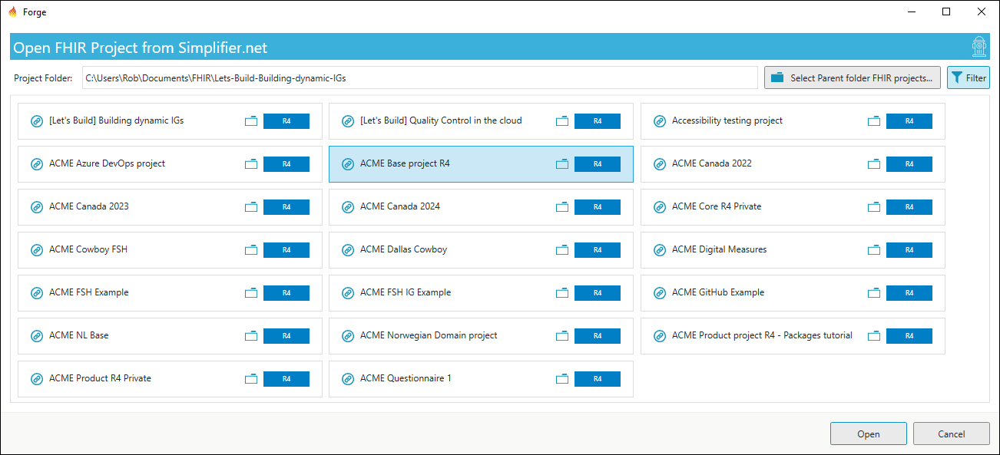
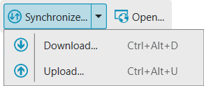

# Integration with Simplifier

[Simplifier.net](https://simplifier.net/) is a FHIR specification development, collaboration and publishing platform. 
The documentation for the platform can be found [here](https://docs.fire.ly/projects/Simplifier/).

Forge has an option to connect to a project on Simplifier. This will allow you to 
keep all project files synchronized between Forge and Simplifier.

## Create a FHIR Project on Simplifer

When starting a new project, you first have to create a project on Simplifier.
Clicking the button  
`Create FHIR Project on Simplifier.net...` will open your 
browser to the **Create project** page on Simplifier.net using your Simplifier account.

Enter you project details and click `Create`.

## Connect to a FHIR Project on Simplifer

Click `Connect to FHIR Project on Simplifer.net...`. This will open a dialog
listing all the available projects on Simplifier you can connect with.

The project folder is set to your **Documents** folder by default. However you can
change the project folder by clicking `...`. Forge will remember the project 
folder you selected.

When you select a different project from the list, the project folder name is updated 
automatically. Note that you can still manually change the project folder name if you want.
Project folders that are already connected to Simplifier are disabled for selection.

The `Filter` button hides projects that are not compatible with the FHIR version of Forge. 
Turn the filter off to list project from all FHIR versions.

Click `Connect` to create the project folder and download all project files from Simplifier.

If you select an existing project folder that already contains resource files, you have 
to confirm to overwrite the existing files before you can continue.

When your project folder is connected with Simplifier, the project toolbar
contains an additional section.

## Status of project files

When you add new profiles to your project or modify existing profiles, Forge indicates 
this in the project list view with yellow status icons. A pen indicates a modified file 
and a pen with a plus sign indicates an added file.

Forge is watching for changes in your project folder so any modifications you make outside 
of Forge will be reflected in the list view. Note that changes to non-resource files 
(for example mark-down files) in your project folder will be included as well when 
synchronizing with Simplifier even though Forge does not list them.

## Synchronizing project files

By clicking the `Synchronize...` button Forge will first download updated files from Simplifier 
and then upload updated files from your folder to Simplifier. You can also download or upload 
separately by clicking the drop-down arrow and clicking the desired option. The `Open...` button
opens a browser to your project on Simplifier.

In all cases a dialog is opened showing you what will be synchronized.

By default, the Normal view is displayed. This view will simply describe what will happen 
without details. If you want to see more details you can switch to the Advanced view by clicking
`Advanced view`.

You can return to the Normal view by clicking `Normal view`. Click `Continue` to
synchronize with Simplifier.

## Conflicting file changes

It can happen that multiple people make modifications to the same resource. 
Forge can detect this but it has limited options to resolve a conflict.
You are not required to resolve conflicts but then these resources will not be 
synchronized.

To resolve conflicts you have to switch to the Advanced view by clicking `Advanced view`.
For each listed file conflict you have 3 choices:
- Accept yours
- Accept theirs
- Leave unresolved

If you click `Accept yours` then your file will be uploaded to Simplifier 
and their version is overwritten. If you click `Accept theirs` then their file 
is downloaded from Simplifier and your version is overwritten.
