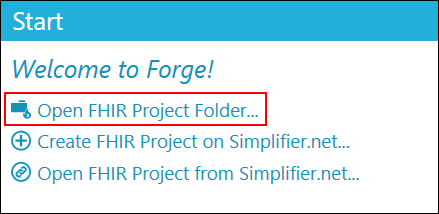
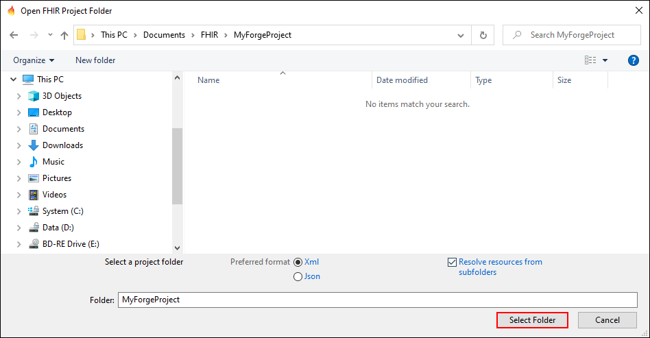
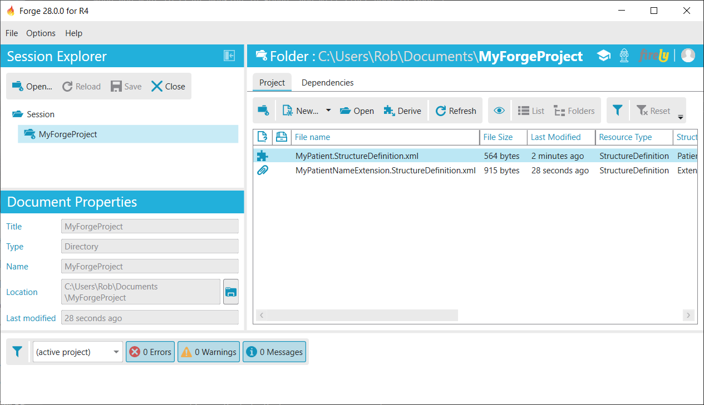

# Open a Project Folder

When you want to start working in Forge, you will first need to open a
project folder (i.e. the working directory containing your profiles).
When you select an item from your recent documents, Forge will
automatically open its associated project folder. In any other case
click `Open FHIR Project Folder...` and select your working directory.

Note that although Forge allows you to select any folder, it would be a
very bad idea to select a general folder like ***C:\Documents*** as your
project folder. If you are managing multiple projects it is good practice to 
organize all of your projects under the same parent folder: for example ***FHIR***. 
If you don't have a specific folder for your project,
please create one. For example, let's open my project folder called
***MyForgeProject***. By default subdirectories are not included. Select this
option to include all subdirectories of the selected folder. This may be
convenient if you want to organize your profiles in separate folders,
but still want to be able to edit them in the same project. On the other
hand, if you have a subdirectory containing old versions of your
profiles, it would be better to ignore the subdirectory.

Click `Select Folder` to open your folder. Now Forge will show you all
profiles and extensions contained in your folder.

When there's a lot of content in your folder, you may want to use one of
the available filters:

- Document type (FHIR documents only or all documents supported by Simplifier)
- Resource type (e.g. StructureDefinition)
- Structure category (e.g. profile or extension)
- Structure type (e.g. Patient).

You can also switch views. By default the `List` view is shown, showing
all content in the folder and all its subdirectories (when these are
included). The `Folders` view allows you to browse the subdirectories
one by one as if you're using your file explorer.

Select one of the structure definitions from the content list and choose
`Open` to open it in Forge. Choose `New...` to add new structure
definitions to your project. Note that they will not be saved
automatically. To add a newly created structure definition to your
project, select `Save` and save it to your
project folder. The new file is autmatically added to the content list.

In the Session Explorer, you can choose
`Open...` to open another project folder. Note
that this will not automatically close your current project folder. To
close a project folder, select the folder in the Session Explorer and
select `Close`. Or select a single item in your project to close.