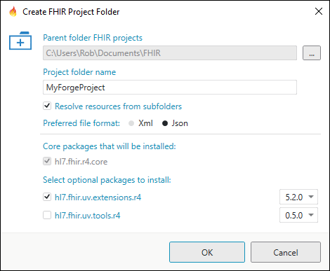
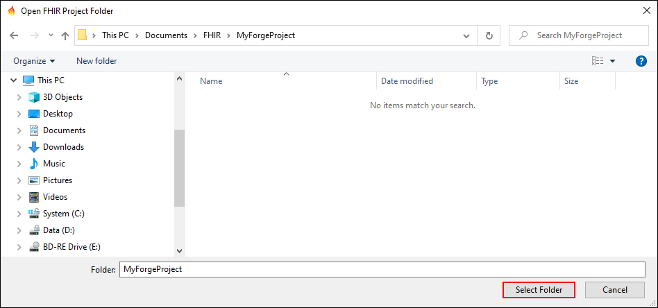
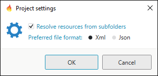
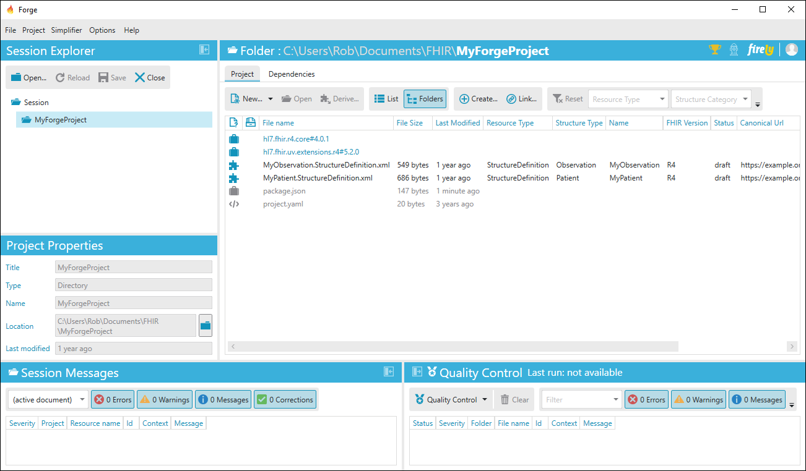
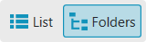

Create or Open a Project Folder
===============================

When you want to start working in Forge, you will first need to create or open a
project folder (i.e. the working directory containing your profiles).

.. note::
   When you select an item from your recent files, Forge will automatically open its associated project folder.

.. attention:: 
   When you already have a project on **Simplifier.net** or you want to start using Simplifier for your FHIR projects then read the chapter :ref:`integration-with-simplifier` first. 

Create a new Project Folder
---------------------------

Click ``Create FHIR Project Folder...``.

The **Create FHIR Project Folder** dialog is opened.

Enter a name for your new FHIR project folder here. You can change the default parent folder for your FHIR project. 
The core package will be be added as a dependency to your project automatically.

The following project settings are available: 

* Resolve resources from subfolders
* Preferred file format (XML or JSON)

Click ``OK`` to create your FHIR project.

Open an existing Project Folder
-------------------------------

Click ``Open FHIR Project Folder...`` and select your working directory.

.. figure:: ../images/OpenFolder.png
   :alt: Open a folder in Forge
   :width: 350

Note that although Forge allows you to select any folder, it is not advisable to select a general folder like
**This PC > Documents** as your project folder. If you are
managing multiple projects it is good practice to organize all of your
projects under the same parent folder: for example **FHIR**.

If you don’t have a specific folder for your project yet, please create one first. 
Let’s open the project folder called **MyForgeProject**.

Click ``Select Folder`` to open your folder. Now Forge will show you all
files contained in your folder.

Project Settings
----------------

A dialog with settings for your project folder can be opened from the ``Project`` menu.

Deselect the **Resolve resources from subfolders** option if you want to exclude all subdirectories of the selected folder. 
This may be convenient if you have a subdirectory containing old versions of your
profiles. In that case it would be better to ignore the subdirectory.

Project View
------------

When there’s a lot of content in your folder, you may want to use one of
the available filters:

-  Resource type (e.g. StructureDefinition)
-  Structure category (e.g. profile or extension)
-  Structure type (e.g. Patient).

You can also switch views. By default the ``List`` view is shown,
showing all content in the folder and all its subdirectories (when these
are included). The ``Folders`` view allows you to browse the
subdirectories one by one as if you’re using your file explorer.

Select one of the structure definitions from the content list and choose
``Open`` to open it in Forge. Choose ``New...`` to add new structure
definitions to your project. Note that they will not be saved
automatically. To add a newly created structure definition to your
project, select ``Save`` and save it to your project folder. The new
file is autmatically added to the content list.

In the Session Explorer, you can choose ``Open...`` to open another
project folder. Note that this will not automatically close your current
project folder. To close a project folder, select the folder in the
Session Explorer and select ``Close``. Or select a single item in your
project to close.
