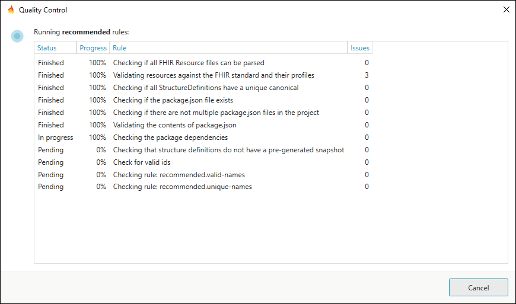
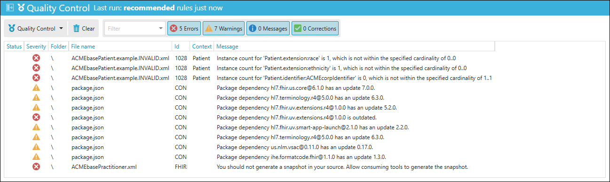
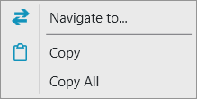

# Quality Control

Important

<a class="reference external" href="https://simplifier.net/pricing">This feature is available from the Professional plan and up</a>.

In the Forge **Community Edition** you can only run **free** rules.

## Introduction

Please visit the [Simplifier documentation](https://docs.fire.ly/projects/Simplifier/develop/quality-control.html) for an introduction 
to Quality Control: Validating FHIR Projects.

## Running rules in Forge

You can access Quality Control from the Quality Control Messages toolbar located at the right bottom of Forge.

Clicking on the button wil open a drop down menu with the available validation rulesets you can run on your project.

When you run a ruleset, a window will open displaying the individual rules and the current progress.

If the Quality Control process takes a very long time you can click `Cancel` to abort the operation.

## Quality Control Messages

The result of the Quality Control is presented in the **Quality Control Messages** panel.

If you double click on a message then the associated file is opened in Forge. When available, the context information 
is used to select the corresponding element in the resource as well.

You can also right click on a message to open a context menu:

`Navigate to...` opens the associated file and selects the corresponding element when available. `Copy` copies 
the message to the clipboard. `Copy all` copies all visible messages to the clipboard.

## Adding your own rulesets

You can define your own ruleset by creating a file with the pattern **\<name\>.rules.yaml** 
in your project folder. Forge will recognize the file and add a new menu item to the Quality Control drop down menu.

