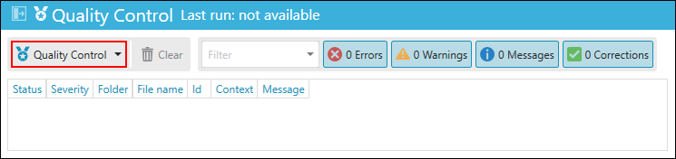
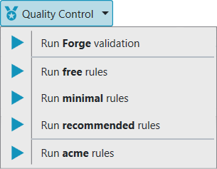
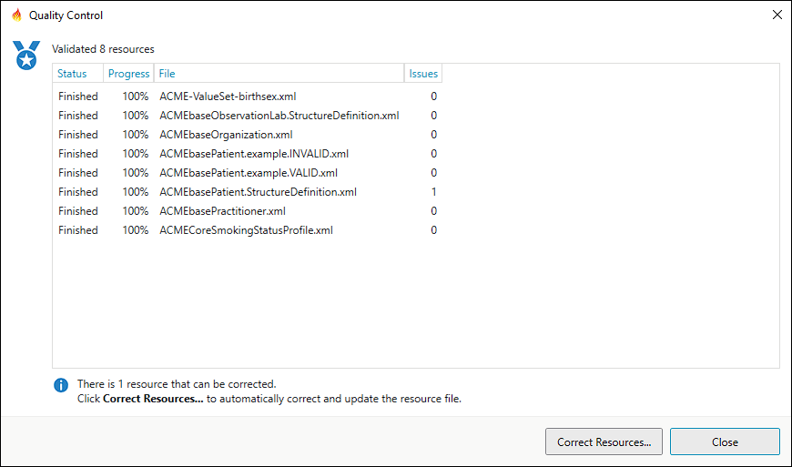

Quality Control
===============

.. important::
   `This feature is available from the Professional plan and up <https://simplifier.net/pricing>`_.

In the Forge **Community Edition** you can only run **free** rules.

Introduction
------------

Please visit the :ref:`Simplifier
documentation <simplifier_docs:QC>`
for an introduction to Quality Control: Validating FHIR Projects.

You can access Quality Control from the **Quality Control** toolbar
located at the right bottom of Forge.

Clicking on the button wil open a drop down menu with the available
validation rulesets you can run on your project.

Running rules in Forge
----------------------

When you run a ruleset, a window will open displaying the individual
rules and the current progress.

.. figure:: ../images/QualityControl_Progress.png
   :alt: QualityControl_Progress
   :width: 870

If the Quality Control process takes a very long time you can click
``Cancel`` to abort the operation.

Running Forge validation
------------------------

Forge validation will use the Forge engine to validate your resources.
In addition to errors, warnings and messages, Forge validation
will also list any corrections that can be made to your resources.

When you run Forge validation, a window will open displaying the individual 
files and the current progress.

If the Forge validation process takes a very long time you can click
``Cancel`` to abort the operation.

When the Forge validation has found resources for which corrections can be made
you have the option to automatically correct and update your resources.

Click ``Correct Resources...`` to automatically correct and update your resources
or click ``Close`` to inspect the Quality Control messages.

Quality Control messages
------------------------

The result of the Quality Control is presented in the **Quality
Control** panel.

.. figure:: ../images/QualityControl_Messages.png
   :alt: QualityControl_Messages
   :width: 1296
   
If you double click on a message then the associated file is opened in
Forge. When available, the context information is used to select the
corresponding element in the resource as well.

You can also right click on a message to open a context menu:

.. figure:: ../images/QualityControl_Messages_Menu.png
   :alt: QualityControl_Messages_Menu
   :width: 175

``Navigate to...`` opens the associated file and selects the
corresponding element when available. ``Copy`` copies the message to the
clipboard. ``Copy all`` copies all visible messages to the clipboard.

Adding your own rulesets
------------------------

You can define your own ruleset by creating a file with the pattern
**<name>.rules.yaml** in your project folder. Forge will recognize the
file and add a new menu item to the Quality Control drop down menu.
