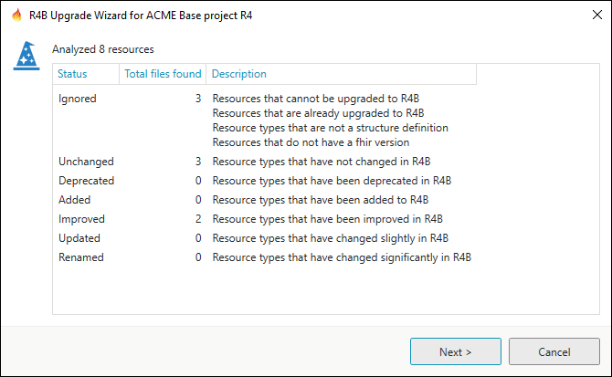
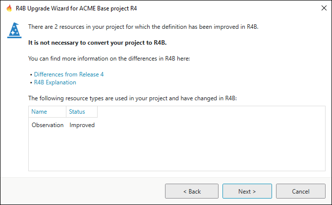
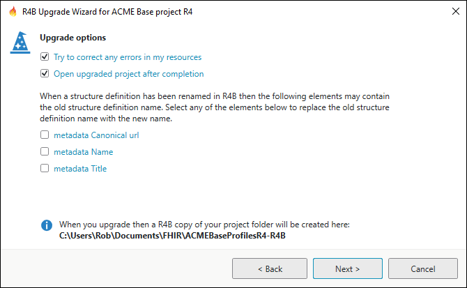

R4B Upgrade Wizard
==================

.. important::
   `This feature is available from the Professional plan and up <https://simplifier.net/pricing>`_.

In the Forge **Community Edition** you can only perform a project analysis.

Introduction
------------

The R4 and R4B versions of Forge feature a R4B Upgrade Wizard for your FHIR project.

.. note:: The wizard only supports upgrading a R4 project to R4B.

The wizard comprises two parts:

- Analysis
- Upgrade

The wizard in the R4 version of Forge can only perform a project analysis.
You will need the R4B version of Forge to be able to upgrade your project.

The R4B Upgrade Wizard can be found in the ``Project`` menu and in the context
menu of a project item in the Session Explorer.

Documentation on the web
------------------------

The following links provide useful information on R4 versus R4B:

- `R4B Explanation <http://hl7.org/fhir/r4b/r4b-explanation.html>`__
- `Differences from Release 4 <https://hl7.org/fhir/r4b/diff.html>`__
- `Strategies for dealing with R4 and R4B <https://confluence.hl7.org/display/FHIR/Strategies+for+dealing+with+R4+and+R4B>`__

Analysis
--------

Forge categorises R4B changes using the following status descriptions:

.. list-table::
   :header-rows: 1

   * - Status
     - Description
   * - Ignored
     - Resources or files that cannot be upgraded. For example because the file is not 

       a FHIR resource or the resource is already a R4B resource.
   * - Unchanged
     - Resource types that have not changed in R4B.
   * - Deprecated
     - Resource types that have been deprecated in R4B.
   * - Improved
     - Resource types that only have additional new features in R4B.
   * - Updated
     - Resource types that have some changes in R4B. 
   * - Renamed
     - Resource types that have extensive changes in R4B.

After analysing all your project files, the wizard shows a list with the number
of files that have been found for each status category. 

Click ``Next >`` to view the analysis summary.

The summary page gives a recommendation for upgrading, two links to R4B information on the HL7 website
and a list of the resource types that you use in your project that have changes in R4B.

Upgrade
-------

Click ``Next >`` to view the upgrade options.

-  **Try to correct any errors in my resources**

   When this option is checked each resource is automatically loaded after upgrading.
   Forge will then validate all elements and correct any invalid elements.

-  **Open upgraded project after completion**

   When this option is checked Forge will open the upgraded project after completion.

If you have used the name of a structure definition type in your resource (for example MyMedicinalProductIngredient)
and that structure definition type has been renamed in R4B then you have the option to update the name in the upgraded resource as well
(i.e. to MyIngredient). The wizard can inspect the following elements and update the value if it contains
the old structure definition name:

- metadata Canonical url
- metadata Name
- metadata Title

.. note:: The upgrade wizard does not rename your file.

Forge will create a new folder for your upgraded project using the name of your R4 project folder and appending it with -R4B (for example **ACMEBaseProfilesR4-R4B**).
All your project folders and files will be copied to the new folder except for the **.Simplifier** system folder and git system 
folders (i.e. folders that start with **.git**).

Click ``Next >`` to start the upgrade.

When the upgrade process has finished a log file is created in the new project folder.

.. code-block::

    Upgrade log for C:\Users\Rob\Documents\FHIR\ACMEBaseProfilesR4-R4B\ACMEbaseObservationLab.StructureDefinition.xml
        VersionUpdated
    	    4.0.1 > 4.3.0
        MinorChanges
    	    Observation.subject > New target types available for type reference: Organization, Procedure, Practitioner, Medication, Substance
    Upgrade log for C:\Users\Rob\Documents\FHIR\ACMEBaseProfilesR4-R4B\ACMEbaseOrganization.xml
    	VersionUpdated
    		4.0.1 > 4.3.0
    Upgrade log for C:\Users\Rob\Documents\FHIR\ACMEBaseProfilesR4-R4B\ACMEbasePatient.StructureDefinition.xml
    	VersionUpdated
    		4.0.1 > 4.3.0
    Upgrade log for C:\Users\Rob\Documents\FHIR\ACMEBaseProfilesR4-R4B\ACMEbasePractitioner.StructureDefinition.xml
    	VersionUpdated
    		4.0.1 > 4.3.0
    Upgrade log for C:\Users\Rob\Documents\FHIR\ACMEBaseProfilesR4-R4B\ACMECoreSmokingStatusProfile.xml
    	VersionUpdated
    		4.0.1 > 4.3.0